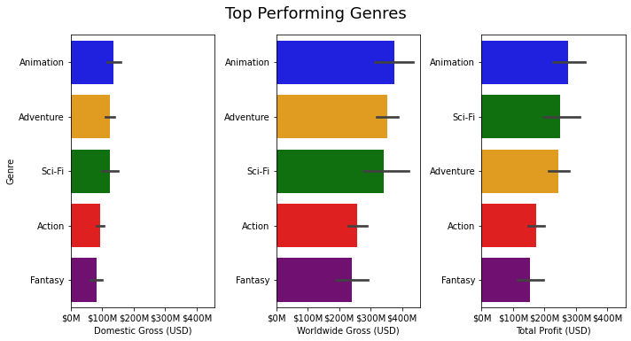

# Microsoft Film Studios Film Recommendations

***
Author: Brian Tracy(mailto:brtracy1984@gmail.com)

## Overview
***

Newly created Microsoft Film Studios is looking for recommendations on what their first film should be. Analysis of film metadata from [IMDB](https://www.imdb.com/) and financial data from [The Numbers](https://www.the-numbers.com/) will be used to make recommendations to the studio.

## Business Problem
***

Microsoft, one of the big five tech companies in the world, is the last to make the foray into original video content production. While the company may know almost everything about making software people will use, they don't know much about making films people will watch. What they lack in knowledge they make up for in resources, and now they want to throw their weight against the box office and make a successful movie.

Questions being considered:
* What genre has been performing well in the box office recently?
* When should the film be released to maximize profit?
* What is the recommendation for production budget?

## Data
***

IMDB is one of the largest sites for movie news and information and provide data such as ratings, film titles, genres, crew/principals, and biographical data. The data files provided for the project are from 2019. The Numbers is a website for movie financial information and provide data on production costs and gross sales. The data files provided for the project are also from 2019.

## Methods
***

This project uses descriptive analysis of past film data to make recommendations for future film success, not predictions.

## Results
***

Microsoft Film Studios should make an animated feature film as it's the most successful film across all three financial features. Animation is more of a style of film, the most successful combination of genres to be animated is adventure/comedy.

***

Microsoft Film Studios should release their animated film in June as it's the highest potential for profit compared to non-animted films.

***

Microsoft Film Studios should expect to spend at least $200M USD, as well as market and release the film internationally as there is a larger increase in profit worldwide compared to domestic profit.

***

## Conclusions
***

The analysis leads to three recommendations for Microsoft Film Studios' first studio production:
* Make an **animated adventure/comedy**
* Expect to spend at least **$200M USD**
* Release the film to an international audience in the month of **June**

## Next Steps
***

Futher analyses could yield additional insights on film recommendations:
* Find larger, more comprehensive data that contains more features as well as a larger range of dates
* Explore original properties versus franchises to see how it affects genre recommendation
* Any other role types have aggregate data that may be interesting?
* Analyze current public interest trends in non-optioned properties: is there franchise potential to drive more future revenue?

## Repository Structure
***

├── data/
├── images/
├── __init__.py
├── README.md
├── presentation.pdf
└── student.ipynb
